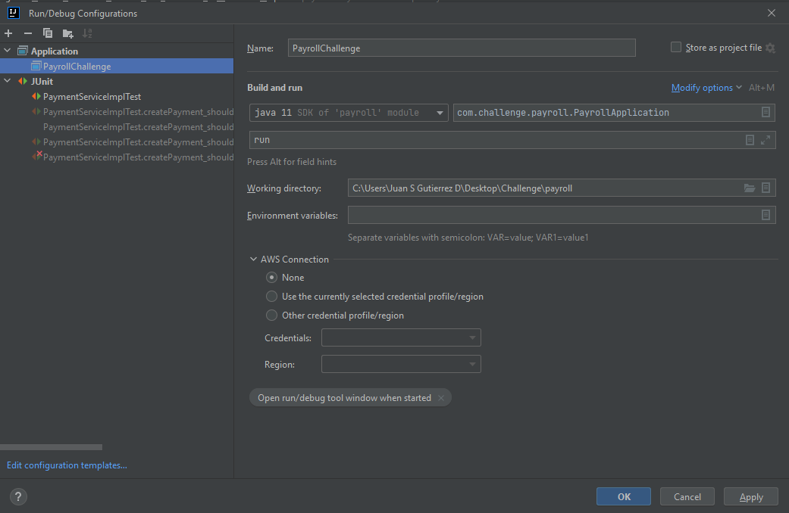
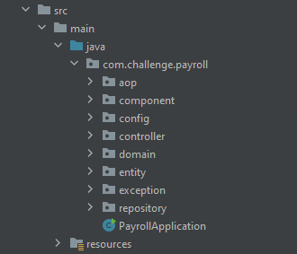
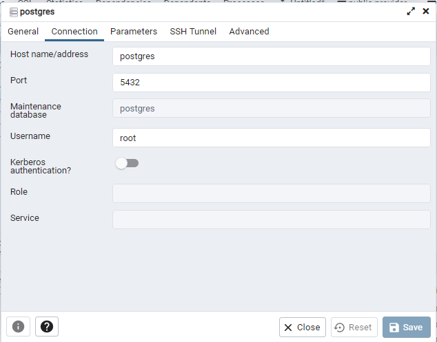
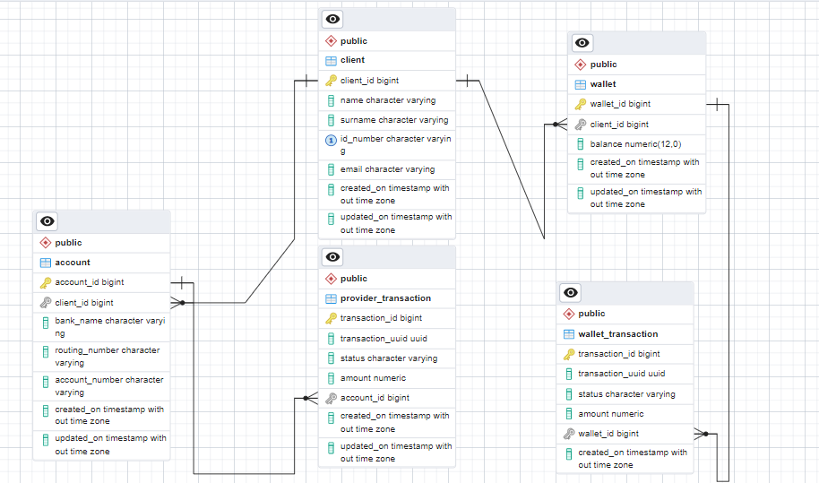

# Project Payroll

This project aims to create the back-end for simulating a payment gateway. A web service is created using Spring and Java to achieve this purpose.

## Dependencies

In order to make any modifications and/or deploy the file, you will need to have the following dependencies configured on your system:

- Java 11
- Maven
- IDE (preferably IntelliJ)
- Docker and Docker Desktop (preferably installed)

## Libraries

- org.springframework.boot:spring-boot-starter-parent:2.7.9
- org.springframework.boot:spring-boot-starter-data-jpa
- org.springframework.boot:spring-boot-starter-web
- org.postgresql:postgresql
- org.springframework.boot:spring-boot-starter-test
- org.springframework.boot:spring-boot-starter-validation
- org.projectlombok:lombok:1.18.26
- org.junit.jupiter:junit-jupiter-engine:5.6.3 (scope: test)
- org.junit.jupiter:junit-jupiter-api:5.6.3 (scope: test)
- org.junit.jupiter:junit-jupiter-params:5.6.3 (scope: test)
- junit:junit (scope: test)

## IntelliJ Configuration

## Folder Hierarchy

As you can see from the image, the project is divided into several folders. Below, the purpose of each one is specified:

- aop: folder to store aspects (both interface and logic of each one).
- component: transversal components of the project. (Example: error-saving logic or simulation of asynchronous tasks).
- config: folder for Spring beans or customized configuration.
- controller: entry point definitions for the service.
- domain: folder containing interfaces, implementations, models, and enumerations to be used within the business logic.
- entity: entities of the used tables.
- exception: folder to store defined exceptions for development.
- repository: interfaces and entry points to access data sources.

# Docker Compose Configuration

This repository contains the Docker Compose configuration for running a PostgreSQL database and a pgAdmin4 container for managing it.

## Prerequisites

Make sure you have Docker and Docker Compose installed on your machine before proceeding with the following steps.

## Getting Started

To start the PostgreSQL database and pgAdmin4 containers, run the following command in the root directory of this repository:

docker-compose up --build

This will spin up the PostgreSQL database and pgAdmin4 containers. If you want to start the containers in the background, run:

To shut down the containers, run:

docker-compose down

## Environment Variables

The following environment variables are defined in the `docker-compose.yml` file:

- `DATABASE_HOST`: The hostname of the PostgreSQL database container.
- `POSTGRES_USER`: The username for accessing the PostgreSQL database.
- `POSTGRES_PASSWORD`: The password for accessing the PostgreSQL database.
- `PGADMIN_DEFAULT_EMAIL`: The email address for the default pgAdmin4 user.
- `PGADMIN_DEFAULT_PASSWORD`: The password for the default pgAdmin4 user.
- `PGADMIN_LISTEN_PORT`: The port number on which pgAdmin4 listens for connections.

## Accessing pgAdmin4

You can access the pgAdmin4 web interface by opening a web browser and navigating to `http://localhost:8081`. Use the `PGADMIN_DEFAULT_EMAIL` and `PGADMIN_DEFAULT_PASSWORD` environment variables to log in.

## IMPORTANT

Please keep in mind the ports used to run the database inside and outside of the Docker containers. The configuration provided in the Docker Compose file runs the database using port 5432 (please refer to the example configuration image above). When connecting to the database from inside the container using pgAdmin Dockerized, the hostname will be postgres. From outside the container, the exposed port is 5433, as shown in the project's properties file.

## Usage

Before starting the service, make sure that the database is up and running. If you don't want to use the database in Docker, you can change it in the `application.yml` file located at `src/main/resources/application.yml`.

When starting the service, it will automatically execute the scripts in the specified database in the `application.yml` file. These scripts can be found in `src/main/resources/import.sql`.

To run the service, you can use the following command in the root directory of the project:

## Database context

### Database Schema

The following tables are used in the project:

#### client table

- The `client` table stores information about each client.
- The table has columns for `client_id` (primary key), `name`, `surname`, `id_number`, `email`, `created_on`, and `updated_on`.

#### account table

- The `account` table stores information about each account.
- The table has columns for `account_id` (primary key), `client_id` (foreign key to `client` table), `bank_name`, `routing_number`, `account_number`, `created_on`, and `updated_on`.

#### wallet table

- The `wallet` table stores information about each wallet.
- The table has columns for `wallet_id` (primary key), `client_id` (foreign key to `client` table), `balance`, `created_on`, and `updated_on`.

#### wallet_transaction table

- The `wallet_transaction` table stores information about each transaction made from a wallet.
- The table has columns for `transaction_id` (primary key), `transaction_uuid`, `status`, `amount`, and `wallet_id` (foreign key to `wallet` table).

#### provider_transaction table

- The `provider_transaction` table stores information about each transaction made to a provider account.
- The table has columns for `transaction_id` (primary key), `transaction_uuid`, `status`, `amount`, and `account_id` (foreign key to `account` table).

### Suppositions

- It is assumed that a client can only have one account and one wallet.
- The structure for creating payments to providers has been modified. A new field called userId has been added, which is necessary to validate the account related to the user.

## Attachments

- Payroll.postman_collection.json: Postman collection file with examples for consuming the service.
- serviceApi.yml: File with the specification of the service.

These attachments can be used to better understand and test the project.